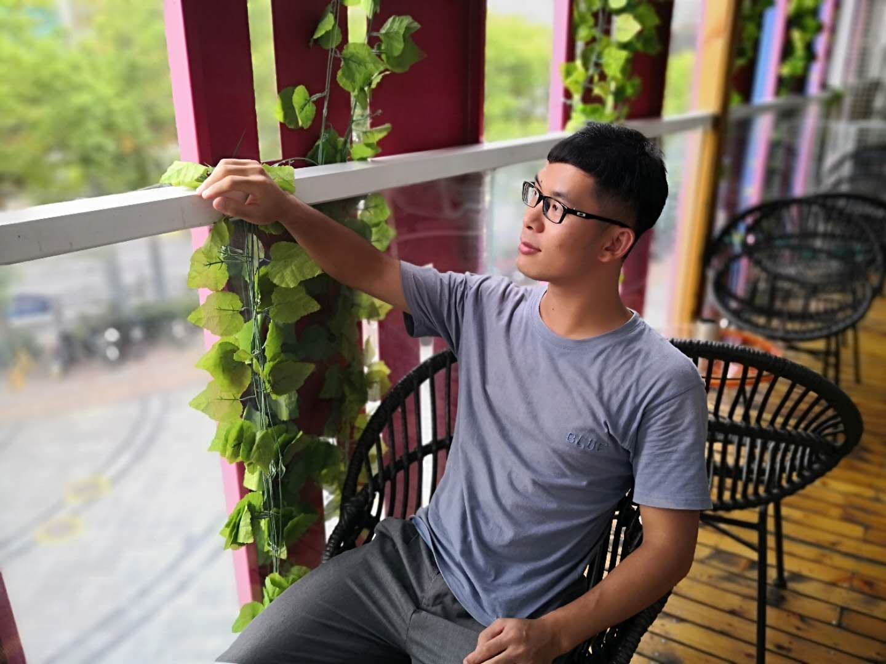

<head>

</head>

<body>

<h2>Biography</h2>
I received my B.S. degree from the School of Mathematics and Computational Science at Hunan University of Science and Technology. I am currently a Master student at the Institute of Information Engineering at Chinese Academy of Sciences and the School of Cyber Security at the University of Chinese Academy of Sciences. My major research interests include machine learning and visual tracking.
		
  
<b>News:</b> One paper accepted in ACM MM 2020.
 We won the first prize in Anti-UAV 2020 challenge, CVPRW 2020. 
  

<h2>Research</h2>
Selected research projects and papers.

<h3><b>MM 2020:</b> <a href="https://2020.acmmm.org">Accurate UAV Tracking with Distance-Injected Overlap Maximization</a></h3>

In this work, we propose distance-injected overlap maximization for accurate UAV tracking. We use distance-injected semantic IoU loss to alleviate the drift problem caused by dual-dynamic disturbances. Furthermore, we conduct feature recalibration network and multi-scale feature concat that improve adaptive feature extraction for UAV targets.
  <b>[<a href="https://dl.acm.org/doi/10.1145/3394171.3413959">Project</a>] [<a href="https://dl.acm.org/doi/10.1145/3394171.3413959">Paper</a>] [<a href="https://dl.acm.org/doi/10.1145/3394171.3413959">Code</a>] </b>

<h3><b>TNNLS 2020:</b> <a href="https://ieeexplore.ieee.org/document/9069312">Cascaded Correlation Refinement for Robust Deep Tracking</a></h3>

In this paper, we propose a cascaded correlation refinement approach to facilitate the robustness of deep tracking. Our approach cascades multiple stages of correlation refinement to progressively refine target localization. We introduce an explicit measure to identify the tracking failure and then leverage a simple yet effective look-back scheme to adaptively incorporate the initial model and on-the-fly model to update the tracking model.
  <b>[<a href="https://github.com/983632847/CCR">Project</a>] [<a href="https://ieeexplore.ieee.org/document/9069312">Paper</a>] [<a href="https://github.com/983632847/CCR">Code</a>] </b>

<h2>Publications</h2>
 Chunhui Zhang, Shiming Ge, Kangkai Zhang, Dan Zeng, Accurate UAV Tracking with Distance-Injected Overlap Maximization, ACM MM 2020 [<a href="https://dl.acm.org/doi/10.1145/3394171.3413959">PDF(baidu:xxxx)</a>] [<a href="https://dl.acm.org/doi/10.1145/3394171.3413959">PDF(google)</a>] [<a href="https://github.com/chunhui-zhang/chunhui-zhang/blob/gh-pages/UTrack_BibTex">BibTex</a>] [<a href="https://dl.acm.org/doi/10.1145/3394171.3413959">code</a>] 

 Shiming Ge, Chunhui Zhang, and Shikun Li, Dan Zeng, Dacheng Tao, Cascaded Correlation Refinement for Robust Deep Tracking, TNNLS 2020 [<a href="https://ieeexplore.ieee.org/document/9069312">PDF(baidu:xxxx)</a>] [<a href="https://ieeexplore.ieee.org/document/9069312">PDF(google)</a>] [<a href="https://github.com/chunhui-zhang/chunhui-zhang/blob/gh-pages/CCR_BibTex">BibTex</a>] [<a href="https://github.com/983632847/CCR">code</a>] 

 Shiming Ge, Zhao Luo, Chunhui Zhang, Yingying Hua, Dacheng Tao, Distilling Channels for Efficient Deep Tracking, TIP 2020 [<a href="https://ieeexplore.ieee.org/document/8891903">PDF(baidu:xxxx)</a>] [<a href="https://ieeexplore.ieee.org/document/8891903">PDF(google)</a>] [<a href="https://github.com/chunhui-zhang/chunhui-zhang/blob/gh-pages/TIPCD_BibTex">BibTex</a>] 

 Shikun Li, Shiming Ge, Yingying Hua, Chunhui Zhang, Hao Wen, Tengfei Liu, Weiqiang Wang, Coupled-View Deep Classifier Learning from Multiple Noisy Annotators, AAAI 2020 [<a href="https://academic.microsoft.com/paper/2997312573">PDF(baidu:xxxx)</a>] [<a href="https://2020.acmmm.org/">PDF(google)</a>] [<a href="https://github.com/chunhui-zhang/chunhui-zhang/blob/gh-pages/CVL_BibTex">BibTex</a>] [<a href="https://academic.microsoft.com/paper/2997312573">code</a>] 

 Chunhui Zhang, Shiming Ge, Yingying Hua, Dan Zeng, Robust Deep Tracking with Two-step Augmentation Discriminative Correlation Filters, ICME 2019 [<a href="https://ieeexplore.ieee.org/document/8785041">PDF(baidu:xxxx)</a>] [<a href="https://ieeexplore.ieee.org/document/8785041">PDF(google)</a>] [<a href="https://github.com/chunhui-zhang/chunhui-zhang/blob/gh-pages/ICME_BibTex">BibTex</a>] [<a href="https://ieeexplore.ieee.org/document/8785041">code</a>] 

<h2>Awards</h2>
 The First Prize in Anti-UAV 2020 Challenge, CVPR Workshop 2020. 
 The First Prize in VisDrone 2019 Task 3: Single-object Tracking Challenge, ICCV Workshop 2019. 
 The First Prize in the China Post-graduate Mathematical Contest in Modeling. 
 The National Scholarship. 

<h2>Support or Contact</h2>
 zhangchunhui@iie.ac.cn 

</body>

